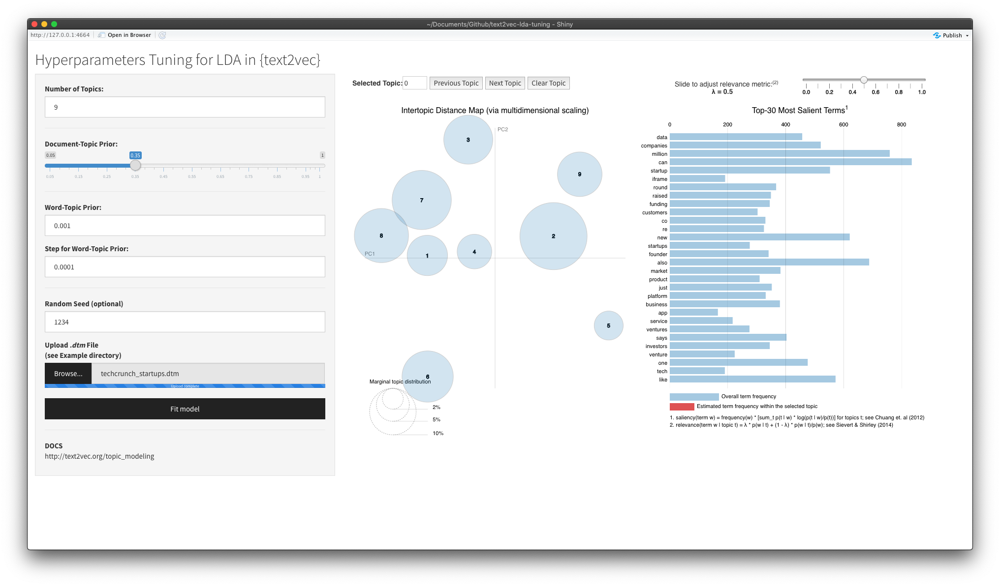

# LDA Hyperparameters Tuning in {text2vec}

A Shiny application to provide convenience for tuning Latent Dirichlet Allocation (LDA) hyperparameters. LDA implementation is provided by {[text2vec](https://github.com/dselivanov/text2vec)} package and visualization is provided by {[LDAvis](https://github.com/cpsievert/LDAvis)} package.

* A demo application can be found [here](https://tmasjc.shinyapps.io/text2vec-lda-tuning/); 
* [Example](Example) directory consists of a walkthrough on how to generate **.dtm** file needed;
